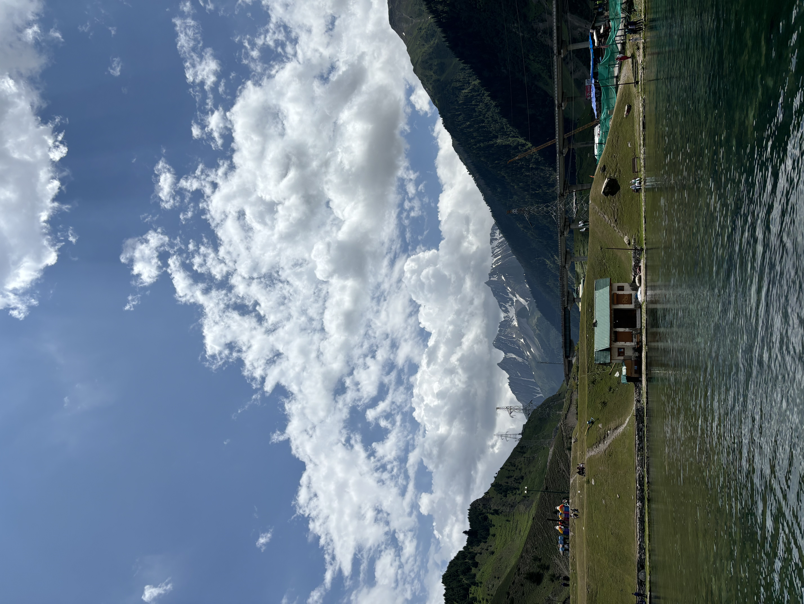

```{r setup, include=FALSE}
knitr::opts_chunk$set(echo = TRUE)
```
Hi! My name is Mehal Agrawal and I am a third year Statistics & Data Science Major at UT Austin. I am interested in the intersection of AI and business. In my free time I enjoy traveling, playing basketball, and hanging out with my family and friends! A fun fact about me is that I love coachiing basketball to kids! 

Here are some of the places I have traveled to:

- Kashmir  
- Iceland  
- Italy  
- Peru  
- Australia

My Github Link: https://github.com/ma66784

```{r}

```
This is a picture I took in Kashmir! 

```{r}
Sys.time()
```


